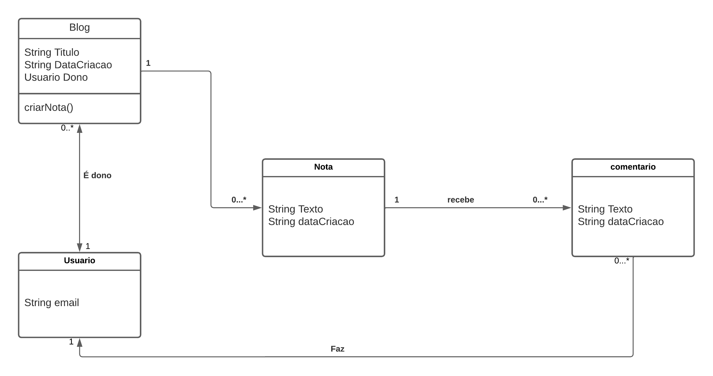
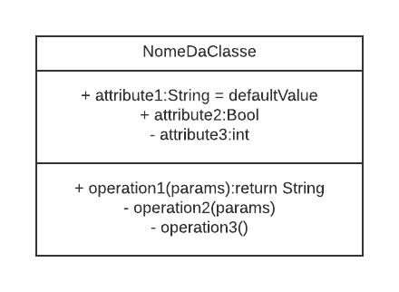
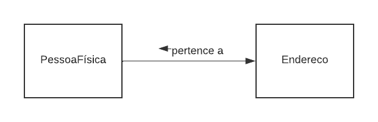
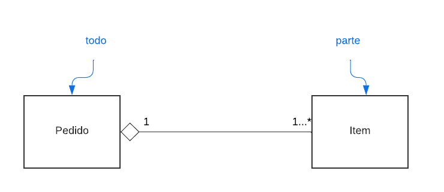
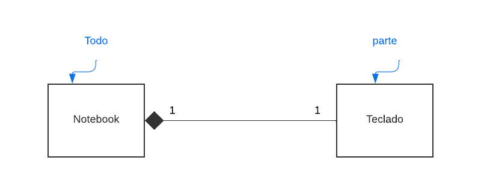
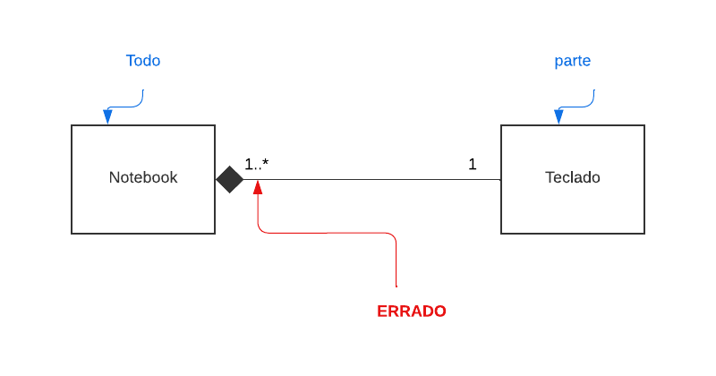
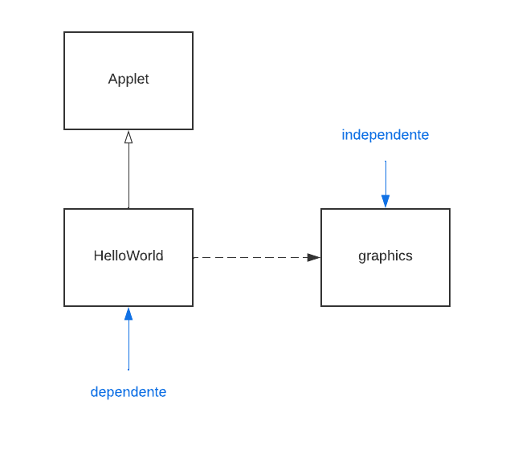
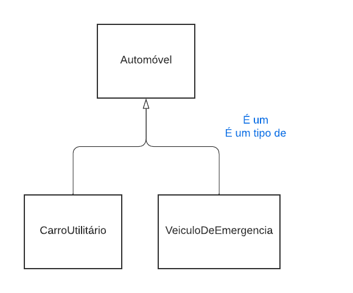

# Engenharia de software

Esse Read me é baseado nos estudos da matéria de engenharia de software I da UFBA e no livro "Engenharia de Software Moderna" de Marco Tulio Valente

# Table of contents

- [Introducao](#introducao)
  - [O que se estuda em engenharia de software?](#o-que-se-estuda-em-engenharia-de-software)
  - [Engenharia de Requisitos](#engenharia-de-requisitos)
    - [Requisitos funcionais](#requisitos-funcionais)
    - [Requisitos nao funcionais](#requisitos-nao-funcionais)
  - [Projeto de Software](#projeto-de-software)
    - [Interfaces Providas](#interfaces-providas)
    - [Interfaces Requeridas](#interfaces-requeridas)
    - [Exemplo](#exemplo)
  - [Construcao de Software](#construcao-de-software)
  - [Testes de Software](#testes-de-software)
- [Diagrama de classe](#diagrama-de-classe)
  - [Exemplo](#exemplo)
  - [Classes](#classes)
    - [Atributos](#atributos)
    - [Métodos](#mtodos)
    - [Exemplo](#exemplo)
  - [Relacionamentos](#relacionamentos)
    - [Associacao](#associacao)
      - [Exemplo:](#exemplo)
      - [Multiplicidade](#multiplicidade)
    - [Agregacao](#agregacao)
      - [Exemplo](#exemplo)
    - [composicao](#composicao)
      - [Exemplo correto](#exemplo-correto)
      - [Exemplo Errado](#exemplo-errado)
    - [Dependência](#dependncia)
      - [Exemplo](#exemplo)
    - [Generalizacao](#generalizacao)
      - [Exemplo](#exemplo)

<small><i><a href='http://ecotrust-canada.github.io/markdown-toc/'>Table of contents generated with markdown-toc</a></i></small>


# Introducao
## O que se estuda em engenharia de software?

Para responder essa pergunta, vamos nos basear no [SWEBOK](https://www.computer.org/education/bodies-of-knowledge/software-engineering) que é um documento que visa documentar todos os princípios de engenharia de software.

O [SWEBOK](https://www.computer.org/education/bodies-of-knowledge/software-engineering) define 12 áreas de conhecimento em Engenharia de software:

1. Engenharia de Requisitos;
2. Projeto de Software;
3. Construcao de Software;
4. Testes de Software;
5. Manutencao de Software;
6. Gerência de Configuracao;
7. Gerência de Projetos;
8. Processos de Software;
9. Modelos de Software;
10. Qualidade de Software;
11. Prática Profissional;
12. Aspectos Econômicos.

## Engenharia de Requisitos

Os requisitos de um sistema definem o que ele deve fazer e como ele deve operar. Portanto, a Engenharia de Requisitos inclui o conjunto de atividades realizadas com o objetivo de definir, analisar, documentar e validar os requisito de um sistema. Tais requisitos podem ser definidos de duas maneiras:

### Requisitos funcionais

Funcionalidades ou serviços que devem ser realizados pelo sistema (abordagem mais clara para o cliente ou usuário sobre o que o sistema faz)

### Requisitos nao funcionais

Como o sistema deve operar para realizar tais serviçoes (são requisitos técnicos que geralmente não possuem uma abordagem muito clara para um leigo em tecnologia)

## Projeto de Software

Durante um projeto de software, são definidas suas principais unidades , porém, apenas a nível de **interface**

Ou seja, definiremos apenas as **assinaturas** das classes, métodos e atributos dessas unidades **sem implementar sua lógica de funcionamento**

Tais **interfaces** podem ser definidas em 2 tipos:

### Interfaces Providas

Aqueles serviços que uma unidade de código torna **público para uso do sistema**

### Interfaces Requeridas

São interfaces que são **Requeridas por outras interfaces**, ou seja, que são utilizadas por outras interfaces

### Exemplo

Considere as seguintes interfaces para um sistema de banco:

```java
class ContaBancaria{
    private Cliente cliente;
    private double saldo;
    public double getSaldo();{...}
    public String getNomeCliente(){...}
    public String getExtrato(Date inicio){...}
}
```
A classe **ContaBancaria** oferece uma interface para as demais classes do sistema por meio de 3 métodos (getSaldo, getNomeCliente e getExtrato). Ou seja, esses 3 métodos são as **interfaces Providas pela classe ContaBancaria**.

Por outro lado, podemos ver que ContaBancaria possui um atributo cujo tipo é **Cliente**, criando assim uma **dependência** da classe **ContaBancaria** para a classe **Cliente** (contaBancaria depende de Cliente). Portanto, a interface de Cliente é uma **interface requerida por ContaBancaria**

Além disso, se pensarmos em um projeto em um nível mais alto cujas unidades de código possuem mais *granularidade* ele é classificado como um projeto arquitetural. Isso significa que a **Arquitetura de software** trata da organizacao de um sistema em um nível de abstracao mais alto do que aquele que envolve classes ou construções semelhantes (organizacao de pastas, microserviços etc)

## Construcao de Software

Trata-se da *implementacao* do sistema, isto é, criar o *código do sistema*. É nesse momento que implementamos o que não foi implementado na etapa de [Projeto de Software](#projeto-de-software). Pensamos nos algoritmos, estruturas de dados, quais frameworks utilizar, padrões de código e etc

## Testes de Software

Consiste na execucao de um programa com um conjunto finito de casos com o objetivo de verificar a integridade e o comportamento do mesmo.

# Diagrama de classe

O diagrama de classe se trata de um diagrama em que se mostra as classes utilizadas no sistema e suas relações

## Exemplo



## Classes

são representadas por **Retangulos** incluindo seu **nome,atributos e métodos**

### Atributos

Representam o estado ou característica que a classe modela, para cada tipo de visibilidade (privada, publica e protegida) existe um símbolo a ser utilizado:

- ***\+ publico:*** vísivel para qualquer classe do sistema
- ***\# protegido:*** visível apenas para as classes do mesmo pacote
- ***\- privado:*** visivel apenas dentro da própria classe

### Métodos

Representam o comportamento da classe, possuem os mesmos níveis de visibilidade que os [atributos](#Atributos)

- ***\+ publico:*** vísivel para qualquer classe do sistema
- ***\# protegido:*** visível apenas para as classes do mesmo pacote
- ***\- privado:*** visivel apenas dentro da própria classe

### Exemplo

Temos a classe *NomeDaClasse*:



## Relacionamentos

Autoexplicativo, são as setas que vão determinar o relacionamento entre cada classe do sistema. Tais setas de relacionamento devem possuir as seguintes caracteristicas:

- ***Nome:*** é a descricao do q essa relacao faz (contém, faz, busca)
- ***sentido de leitura:*** qual é o sentido q ocorre essa relacao, de forma a se entender qual classe é a agente desse relacionamento e qual é a receptora(a clase a contém a classe b) geralmente indicada por uma seta ao lado do nome indicando a direcao
- ***Navegabilidade:*** é indicada pela seta no fim do relacionamento representando os tipos de relacionamento()

### Associacao

é um ***relacionamento estrutural*** que indica que os objetos (atributos) de uma classe estão vinculados a objetos de outra classe
É representada por uma ***linha sólida*** conectando tais classes.

Geralmente essas associações são ***bidirecionais*** porém pode ser necessário especificar uma navegabilidade a essa relacao por meio de uma seta nas extremidades da linha:
#### Exemplo:


Nesse exemplo vemos que PessoaFísica contem Endereco, porém Endereco n sabe quem é pessoa física.

Importante salientar tbm que no exemplo ***o sentido de leitura não é o mesmo que a navegabilidade***. No sentido de leitura apenos vemos que um endereço pertence a uma pessoa física, o sentido de leitura ***não necessáriamente representa uma relacao estrutural***

#### Multiplicidade

É o ***número de instâncias*** de uma classe que se relacionam com ***uma instancia de outra classe***.
São indicados com o número de intanscias possiveis em cima de cada terminal da linha de relacionamento
- ***m:*** Um numero exato de instancias (1, 2, etc)
- ***m...n:*** Uma faixa de valores (0...1, 1...7, etc)
- ***m...\*:*** Uma faixa de valores tendo um numero minimo exato porém um valor máximo muito alto ou infinito (0...\*, 3...\*)
- ***\*:*** uma faixa de valores de 0 até um numero muito alto

### Agregacao

É um tipo especial de associacao onde se especifica um relacionamento do tipo "todo-parte".
Tal relacionamento é representado por ***um losango vazado na extremidade que representa o todo***.
Um objeto ***parte*** tbm pode fazer parte de vários objetos ***todo***

#### Exemplo



Importante salientar tbm que nesse caso uma instância de Pedido pode ter 1 ou mais instâncias de Item

### composicao
É outro tipo especial de ***composicao*** a qual ***um objeto parte*** só pode fazer parte de ***um objeto todo*** e tem sua vida útil coincidente com o dele (a parte só existe se e enquanto o todo existir).
É representado por um ***logando preenchido*** na extremidade do ***todo***
Como nesse caso de associacao o objeto pertence a apenas uma instancia de outro objeto, então não faz sentido uma instancia da parte pertencer a mais de uma instancia de um todo (veja exemplo)

#### Exemplo correto



#### Exemplo Errado



### Dependência

É um relacionamento onde a ***alteracao de um item*** (o ***indenpendente***) pode afetar ***outro item*** (o ***dependente***).
É representado por ***uma linha tracejada*** com uma ***seta apontando para o item independente***

#### Exemplo

Tenha o seguinte trecho de código:
```java
Import java.awt.Graphics;
class HelloWorld extends java.applet.Applet
{
    public void paint (Graphics g) {
      g.drawString("Hello, world!",10, 10);
    }
}

```

Vendo o código podemos ver que existe a seguinte relacao de dependência:



OBS.: A seta com triangulo vazio é representada por [Generalizacao](#Generalizacao)

### Generalizacao

Uma generalizacao é um relacionamento entre ***itens gerais (superclasse)*** e ***itens mais específicos (subclasses)***.
É representado por uma ***linha sólida*** com um ***triangulo vazio*** apontando para o item mais geral

#### Exemplo

