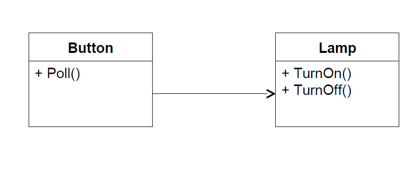
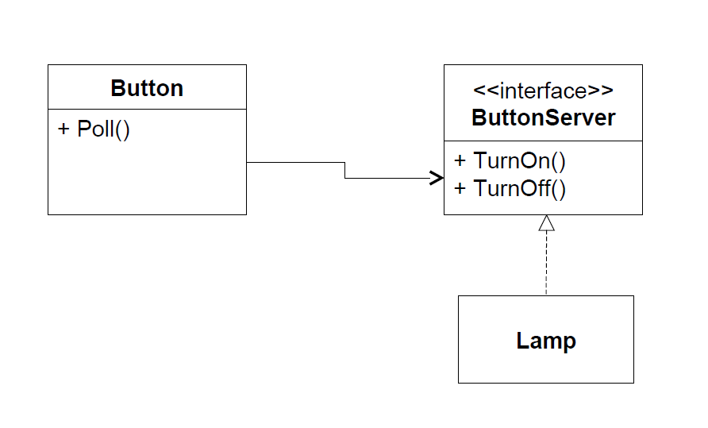

# Princípio de Inversão de Dependências

> Uma classe cliente deve estabelecer
dependências prioritariamente com abstrações
e não com implementações concretas

entre outras palavras, ***prefira interfaces a classes*** visto que abstrações são, em sua maioria, mais estáveis.
implementações concretas (utilizar classes) deixa a classe cliente bem mais sucetível a mudança.

vamos ver esse exemplo:

```java
public class Button
{
    private Lamp itsLamp;
    public void Poll();
    {
        if (/*some condition*/)
            itsLamp.turnOn();
    }
}
```

vemos que a classe Button possui um objeto Lamp e utiliza seu método turnOn() para ser executado segundo uma condição.


Para ***evitar*** que a classe Button ***dependa da implementação do objeto da classe Lamp***, podemos transformar os ***métodos da classe provedora em uma interface***.
Dessa forma, a classe Button ***dependerá apenas da assinatura do método utilizado*** (podendo este ser implementado por qualquer classe além de Lamp)



## Prefira Composição a Herança

***Não utilize herança*** como uma forma de ***reutilização de código***, visto que isso acarreta num forte acoplamento entre as classes.
Para fins de ***reutilização de código use composição***, isso diminui o forte acoplamento sem perder a reutilização de código.
Juntando ***composição e interfaces*** nós temos os mecanismos de ***polimorfismo e reutilização de código*** com uma interdependencia bem menor, o que facilita a refatoração de código e a escalabilidade.

## Princípio de Demeter

>A implementação de um método deve invocar apenas os seguintes outros métodos:
>- De sua propria classe
>- De objetos passados como paramêtros
>- De objetos criados pelo próprio método
>- De atributos da classe do método

Ele enfatiza que um objeto deve ter um conhecimento limitado sobre outros objetos e que ele deve interagir apenas com objetos próximos a ele, evitando acessar diretamente objetos distantes. Isso ajuda a manter o código mais modular, flexível e fácil de manter.
Lembrando que o Princípio de Demeter não impede completamente a interação entre objetos, mas sugere que essa interação seja feita por meio de métodos públicos limitados e bem definidos.

## Corrigindo o código inicial

analisando os códigos de MecanismoEmail e Tarefa, vemos que existem uma interdependencia entre objetos nos seguintes métodos:

- MecanismoEmail:
  - enviarEmail, que depende de:
    - funcionario.getNome()
- Tarefa:
  - realizarTrabalho, que depende de:
    - mecanismoLog.log()
  - completarTarefa, que pedende de:
    - mecanismoLog.log()
    - mecanismoEmail.enviarEmail()

para resolver isso, vamo criar as seguintes interfaces:
- IFuncionario, para lidar com todas as operações de funcionario
- ITarefa, para lidar com as operações de Tarefa
- IMecanismoMensagem, para as operações de envio de mensagem (no caso Email porém poderão existir outras maneiras)
- IMecanismoLog, para as operações de log

além disso, vamos aplicar o conceito de ***Fábrica***

### Fábrica

> Consiste em uma classe estática que irá retornar instâncias de alguma classe dado determinadas entradas

No exemplo dado, vamos criar uma fábrica que retorne objetos que ***implementem as interfaces criadas***.
A vantagem de usar isso é que, apesar de criarmos uma dependência a essa classe fábrica, essa classe será mais estável.
Em caso de refatoração, o único lugar que vamos ter que alterar será nessa fábrica.

Agora substituindo todas as chamadas de classe por interfaces, nós invertemos a dependencia