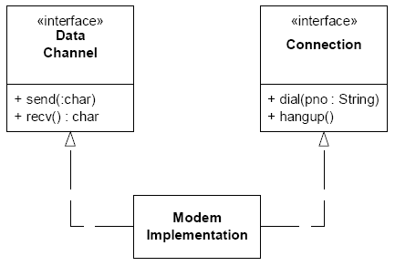

# Princípio da Responsabilidade Única

> Uma classe deve ter apenas uma raão para mudar

- Quando um requisito muda, essa mudança vai se refletir nas responsabilidades das classes
- Se uma classe assume mais de uma responsabilidade, então:
  - Essa classe vai ter mais de uma razão para mudar
  - mudança em uma responsabilidade podem impedir ou deiminuir a habilidade da classe para realizar as outras
  - isso aumenta a fragilidade da classe

Vamos pegar esse exemplo que ***viola o principio***:

  ```java
  class Disciplina {
	void calculaIndiceDesistencia() {
		indice = "calcula índice de desistência";
		System.out.println(indice);
	}
}
  ```
Nesse caso, a classe possui ***2 responsabilidades*** uma de ***calcular o índice*** e outra de ***imprimir o indice na tela***.
Então, nesse caso, devemos segregar tais responsabilidades em 2 classes:

```java
class Console {
    void imprimeIndiceDesistencia(Disciplina disciplina) {
        double indice = disciplina.calculaIndiceDesistencia();
        System.out.println(indice);
    }
}
class Disciplina {
    double calculaIndiceDesistencia() {
        double indice = "calcula índice de desistência";
        return indice;
    }
}
```
É realmente dificil distinguir as responsabilidades de uma classe, vejamos esse próximo exemplo:

```java
interface Modem
{
	public void dial(String pno);
	public void hangup(String pno);
	public void send(char c);
	public char recv();
	
}
```

Vemos que a interface Modem tem 4 responsabilidades: ligar, desligar, enviar e receber.

## As responsabilidades devem ser separadas?

Isso vai depender da aplicação, em como ela vai mudar com seus requisitos e responsabilidades.



## Exercicios

<details>
<summary>Pegue o código que está em "Código inicial", diga quais as responsabilidades que cada classe tem</summary>

- main:
  - printar as mensagens na tela
  - receber as entradas do usuário
  - checar se a entrada é valida
  - criar o id do usuário
- Pessoa:
  - receber os dados sobre a pessoa

</details>

<details>
<summary>refatore as classes de uma forma a respeitar o princípio de responsabilidade unica</summary>

- main:
  - retiramos a responsabilidade de printar as mensagens para uma classe chamada ***gerenciadorMensagens***:
  
```java
package codigoFinal;

import java.io.BufferedReader;
import java.io.IOException;
import java.io.InputStreamReader;
public class GerenciadorMensagens {
  public static void mensagemBoasVindas(){
    System.out.println("Seja bem-vindx");
  }

  public static void mensagemFimPrograma() throws IOException {
    System.out.println("aperte enter para sair");
    BufferedReader teclado = new BufferedReader(new InputStreamReader(System.in));
    teclado.readLine();
  }

  public static void mensagemSolicitarCampo(String campo){
    System.out.println("Qual o seu " + campo + "?");
  }

  public static void mensagemErroValidacao(String campo){
    System.out.println("Vc n forneceu um " + campo + " Valido");
  }
}

```

  - Retiramos a responsabilidade de receber as entradas do usuário e dividimos em 2 partes, uma que ***obtem os dados*** da pessoa e outra que ***cria***:
```java
// Classe que captura os dados da pessoa

package codigoFinal;

import java.io.IOException;
import java.io.BufferedReader;
import java.io.IOException;
import java.io.InputStreamReader;

public class CapturadorDadosPessoa {
	public static Pessoa obterDadosPessoa() throws IOException {
		Pessoa pessoa = new Pessoa();
		BufferedReader teclado = new BufferedReader(new InputStreamReader(System.in));

		GerenciadorMensagens.mensagemSolicitarCampo("Primeiro nome");
		pessoa.setPrimeiroNome(teclado.readLine());

		GerenciadorMensagens.mensagemSolicitarCampo("Ultimo sobrenome");
		pessoa.setUltimoNome(teclado.readLine());

		return pessoa;
	}
}
```

```java
// Classe que cria o id da pessoa 

package codigoFinal;

public class CriadorConta {
	public static void criar(Pessoa pessoa){
		System.out.println("Seu id de usu�rio � " + pessoa.getPrimeiroNome().charAt(0) + pessoa.getUltimoNome());
	}
}
```

- por fim, criamos uma classe que lida com a validação dos dados obtidos para pessoa:

```java
package codigoFinal;

public class ValidadorPessoa {
	public static boolean validar(Pessoa pessoa){
		if (pessoa.getPrimeiroNome().isEmpty()){
			GerenciadorMensagens.mensagemErroValidacao("Primeiro nome");
			return false;
		}
		if (pessoa.getUltimoNome().isEmpty()){
			GerenciadorMensagens.mensagemErroValidacao("Ultimo  nome");
			return false;
		}
		return true;
	}
}
```


</details>